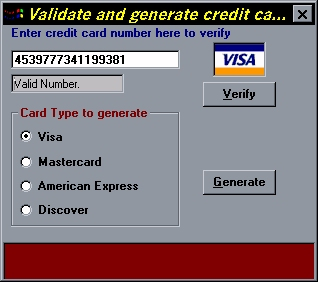



## Credit Card Validate and Generate Credit Card Numbers

### Description

This handy little utility will generate valid credit card numbers for Visa, Mastercard,

American Express and Discover. Like other programs here it uses the LUHN formula for

verification. The random generator uses 11 banks for Visa, 4 for american express, 1 for

mastercard and 1 for discover. (More can be added. check comments in Validate.frm)

This program was not written to defraud but for education purposes only, to show how

simple the LUHN formula is. PLEASE USE IT AS IT IS INTENDED -- EDUCATIONAL PURPOSES.

After the random number has been selected it then verifies it, and will continue to evaluate random numbers until it has selected a valid number.(Takes about 1 to 2 seconds.)

The validate option allows you to input a number and verify it as either Valid or Invalid.

Don't forget to rate this program.

--Enjoy
 
### More Info
 

             |
---                |---
**Submitted On**   |2000-12-08 20:57:56
**By**             |[Mark Duhaime](https://github.com/Planet-Source-Code/PSCIndex/blob/master/ByAuthor/mark-duhaime.md)
**Level**          |Intermediate
**User Rating**    |4.3 (17 globes from 4 users)
**Compatibility**  |VB 5\.0, VB 6\.0
**Category**       |[Miscellaneous](https://github.com/Planet-Source-Code/PSCIndex/blob/master/ByCategory/miscellaneous__1-1.md)
**World**          |[Visual Basic](https://github.com/Planet-Source-Code/PSCIndex/blob/master/ByWorld/visual-basic.md)
**Archive File**   |[CODE\_UPLOAD124901282000\.zip](https://github.com/Planet-Source-Code/mark-duhaime-credit-card-validate-and-generate-credit-card-numbers__1-13444/archive/master.zip)

